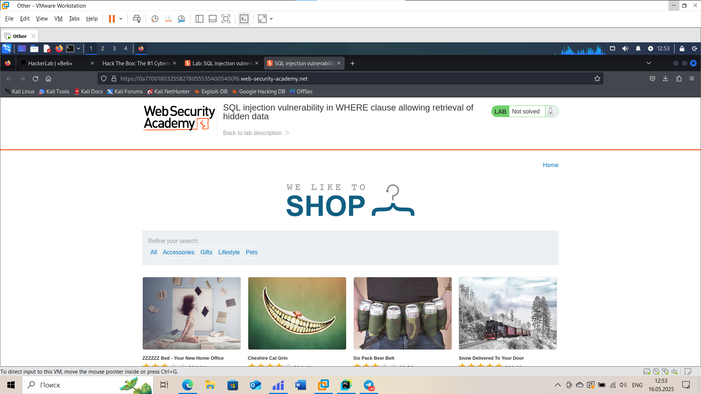
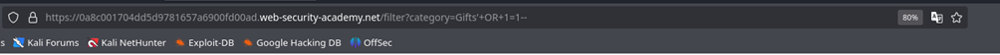
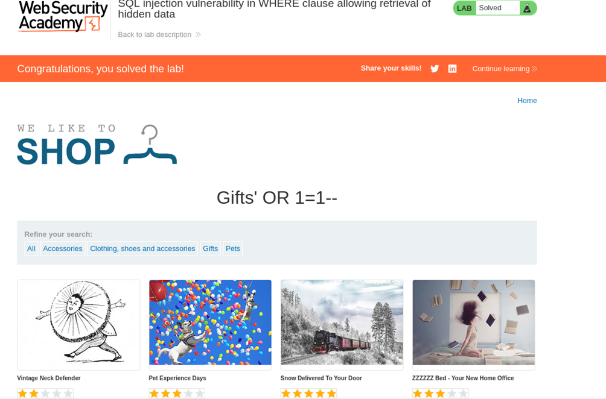

## Реализация уязвимостей
___
1. **SQL injection vulnerability in WHERE clause**.
> Для реализации этой уязвимости я использовал платформу Portswigger.

**Реализация:**

 - Откроем учебный веб-сайт.
    
 > Чтобы решить лабораторную задачу, выполним атаку с помощью SQL-инъекции, в результате которой приложение отобразит один или несколько скрытых продуктов.
 - Найдём поле ввода, которое используется в SQL-запросе с условием WHERE (например, поле для поиска или фильтрации данных).

 - Введём сложный SQL-код, который извлекает скрытые данные, например: '+OR+1=1--.
    

 - Отправим запрос и убедимся, что скрытые товары извлекаются из базы данных.
    
