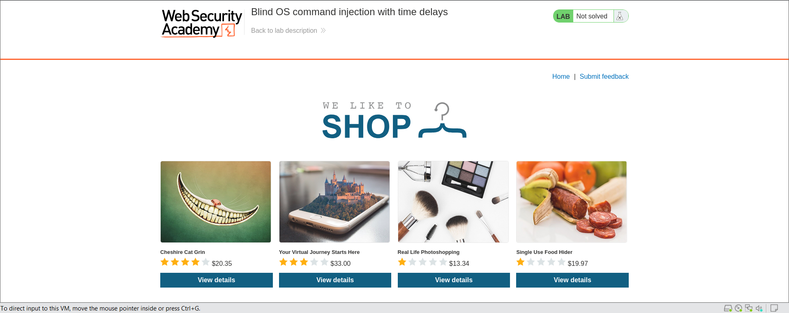
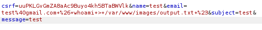

## Реализация уязвимостей
___
1. **SQL injection vulnerability in WHERE clause**.
> Для реализации этой уязвимости я использовал платформу Portswigger.

**Реализация:**

 - Откроем учебный веб-сайт.
    
 > Чтобы решить лабораторную работу, выполним атаку с помощью SQL-инъекции, в результате которой приложение отобразит один или несколько скрытых продуктов.
 - Найдём поле ввода, которое используется в SQL-запросе с условием WHERE (например, поле для поиска или фильтрации данных).

 - Введём сложный SQL-код, который извлекает скрытые данные, например: '+OR+1=1--.
    

 - Отправим запрос и убедимся, что скрытые товары извлекаются из базы данных.
    

2. **Blind OS command injection with time delays**.

> Для реализации этой уязвимости я использовал платформу Portswigger.
- Откроем учебный веб-сайт.

> Приложение выполняет команду оболочки, содержащую данные, предоставленные пользователем. Результат выполнения команды не возвращается в ответ. Чтобы решить лабораторную работу, воспользуемся уязвимостью, связанной с внедрением команд операционной системы вслепую, чтобы вызвать 10-секундную задержку.
- Запустим программу Burp Suite для перехвата трафика.


- Запустим перехват и отправим обратную связь. Перехватим POST запрос.


- Отправим этот запрос в Repeater и добавим полезную нагрузку в параметр CSRF. 
Параметр csrf будет принимать такое значение:

```commandline
csrf=KNJ1uEpRvh3OOCkI79jXUhKCU8csOMpk&name=test&email=test%40gmail.com%26+sleep+10+%23&subject=test&message=test
```


- Отправим изменённый запрос с 10 секундной задержкой.


Ответ получаем через 10 секунд, что говорит нам об удачной атаке.


3. **Blind OS command injection with output redirection**.
> Для реализации этой уязвимости я использовал платформу Portswigger.
- Откроем учебный веб-сайт.

> Приложение выполняет команду оболочки, содержащую данные, предоставленные пользователем. Результат выполнения команды не возвращается в ответе. Однако мы можем использовать перенаправление вывода для записи результатов выполнения команды. Доступная для записи папка находится по адресу:
/var/www/images/ 

> Приложение загружает изображения для каталога товаров из этого каталога. Мы можем перенаправить выходные данные введенной команды в файл в этой папке, а затем использовать URL-адрес загрузки изображений для получения содержимого файла.

- Проверив все возможные поля ввода при помощи полезной нагрузки `& sleep 10 #`, мы определили, что параметр email уязвим для внедрения команды ОС.

```commandline
csrf=uuPKLGvGmZA8aAc9Buyo4kh5BTaBWVlk&name=test&email=qqq%40gmail.com+%26+sleep+10+%23&subject=test&message=test
```


- Теперь попытаемся создать файл в месте, к которому мы можем получить доступ через веб-приложение, и сохранить вывод whoami в этот файл.
Мы запишем вывод whoami в /var/www/images/output.txt



- Откроем только что созданный файл.


У нас получилось выполнить команду whoami и получите выходные данные в созданной на сервере директории.


4. **SSRF with filter bypass via open redirection vulnerability**
> Для реализации этой уязвимости я использовал платформу Portswigger.

- Откроем учебный веб-сайт.

> Чтобы решить лабораторную задачу, изменим URL-адрес stock check для доступа к интерфейсу администратора по адресу http://192.168.0.12:8080/admin и удалим пользователя carlos.

> Для stock checker был ограничен доступ только к локальному приложению, поэтому сначала нам нужно будет найти открытый редирект, влияющий на приложение.

- Перейдём по карточке любого товара, начнём перехват трафика и нажмём на кнопку next product.

Здесь стоит обратить внимание на указание на следующий продукт.


Параметр path помещен в заголовок ответа на перенаправление, что приводит к открытому перенаправлению.
- Теперь рассмотрим `POST /product/stock`

Создадим URL-адрес, который использует уязвимость открытого перенаправления и перенаправляет на интерфейс администратора. Введём его в параметр stockApi в программе проверки запасов.


- Отправляем запрос. Открывается админ панель.


- Попробуем удалить нужного пользователя. Для этого изменим путь, чтобы удалить целевого пользователя.

- 

- Пользователь успешно удалён.


5. **XXE Injection**
> Для реализации этой уязвимости я использовал платформу Portswigger.

- Откроем учебный веб-сайт.

> Для решения лабораторной работы, введём инструкцию XInclude для извлечения содержимого файла /etc/passwd.

- Перейдём на карточку любого товара и начнём перехват трафика. Нажмём на кнопку `check stock`.
Рассмотрим `POST /product/stock`


- Выполним атаку XInclude. Обратимся к пространству имен XInclude и укажем путь к файлу `/etc/passwd` в параметре `productId`.


- Извлекаем содержимое файла.


